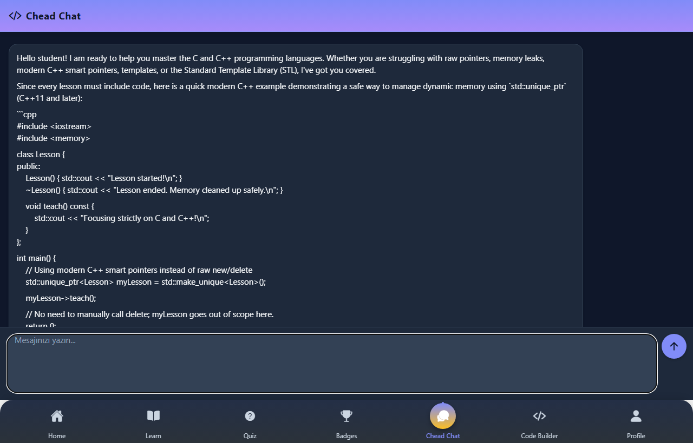

# CodeLearn

C/C++ öğrenme mobil uygulaması — bitirme projesi.  
Expo (React Native) + NestJS + Google Gemini + Judge0.

Portföy: [nadireeee.github.io/portfolio](https://nadireeee.github.io/portfolio/#bitirme)

## Ekranlar

Canlı uygulamadan (dark tema) alınan görüntüler:

| Giriş | Ana ekran | Dersler |
| :---: | :---: | :---: |
|  |  |  |

| Ders içerik | Quiz seçim | Quiz |
| :---: | :---: | :---: |
|  |  |  |

| AI Kod Oluşturucu | Yeni proje | Kod üretildi |
| :---: | :---: | :---: |
|  |  |  |

| Generate sonucu | Rastgele sorular | Derleme hatası + AI |
| :---: | :---: | :---: |
|  |  |  |

| Chead Chat | Chat (scroll) | Profil |
| :---: | :---: | :---: |
|  |  |  |

## Özellikler

- **Dersler & quiz** — C/C++ konuları, Duolingo tarzı sorular
- **AI Kod Oluşturucu** — Gemini ile proje/dosya üretimi (ör. StringLibrary)
- **Rastgele Sorular** — Run / Evaluate, derleme hatası ve AI öneri
- **Chead Chat** — Gemini ile çok turlu sohbet
- **Kod çalıştırma** — Judge0 üzerinden derleme/çalıştırma

## Yapı

```
CodeLearn/
├── frontend/     # Expo React Native (TypeScript)
├── nestjs/       # NestJS API (Gemini, auth, quiz, projects)
├── judge0/       # Kod çalıştırma servisi yapılandırması
└── docs/screenshots/
```

## Kurulum

### Gereksinimler

- Node.js 18+
- PostgreSQL, MongoDB
- (İsteğe bağlı) Judge0
- Google Gemini API anahtarı

### Backend

```bash
cd nestjs
cp .env.example .env
# .env içinde GEMINI_API_KEY ve veritabanı bilgilerini doldur
npm install
npm run start:dev
```

API varsayılan: `http://localhost:3000`

### Frontend

```bash
cd frontend
npm install
npx expo start
```

Expo Go veya web ile aç. API adresinin cihaz/emülatörden erişilebilir olduğundan emin ol.

## Teknolojiler

Expo · React Native · TypeScript · NestJS · Gemini · MongoDB · PostgreSQL · Judge0

## Lisans

Bitirme / eğitim amaçlı. Kaynak kod örnek olarak paylaşılmıştır.
