# CodeLearn

C/C++ öğrenme mobil uygulaması.  
Expo (React Native) + NestJS + Google Gemini + Judge0.

Portföy: [nadireeee.github.io/portfolio](https://nadireeee.github.io/portfolio/#bitirme)

## Ekranlar

| Google giriş | Ana ekran | Dersler |
| :---: | :---: | :---: |
|  | 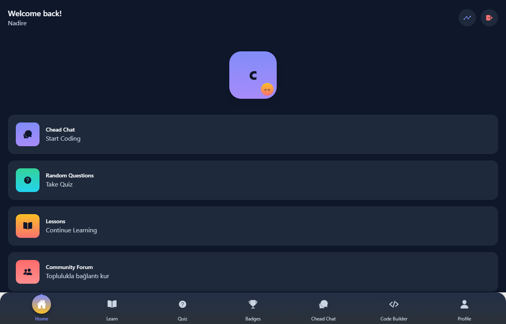 | 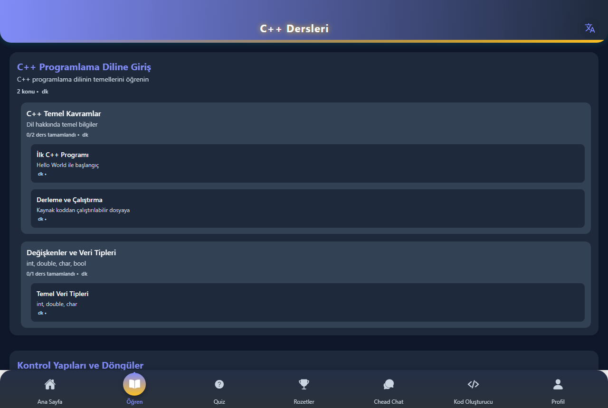 |

| Ders içerik | Quiz seçim | Duolingo quiz |
| :---: | :---: | :---: |
| 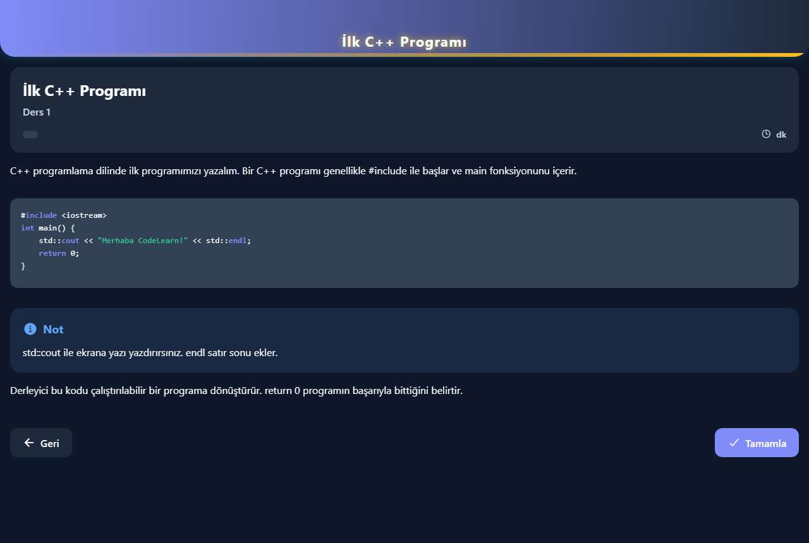 | 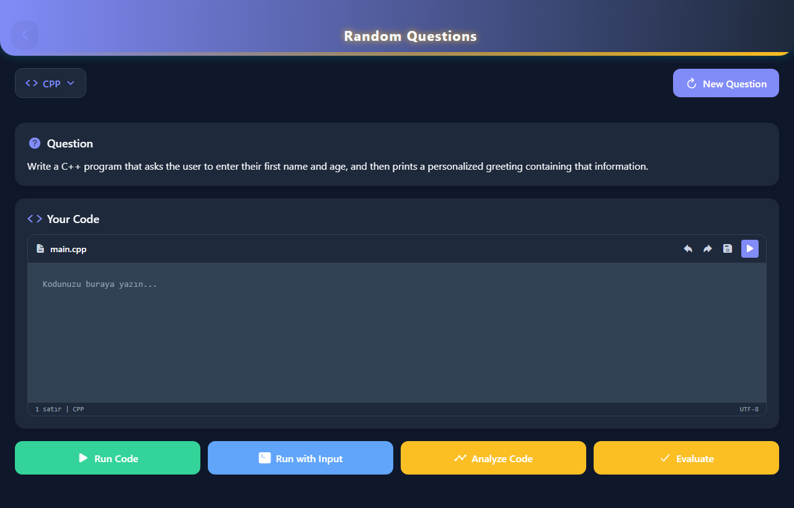 |  |

| Quiz (seri) | Chead sohbet | İlerleme (istatistik) |
| :---: | :---: | :---: |
| 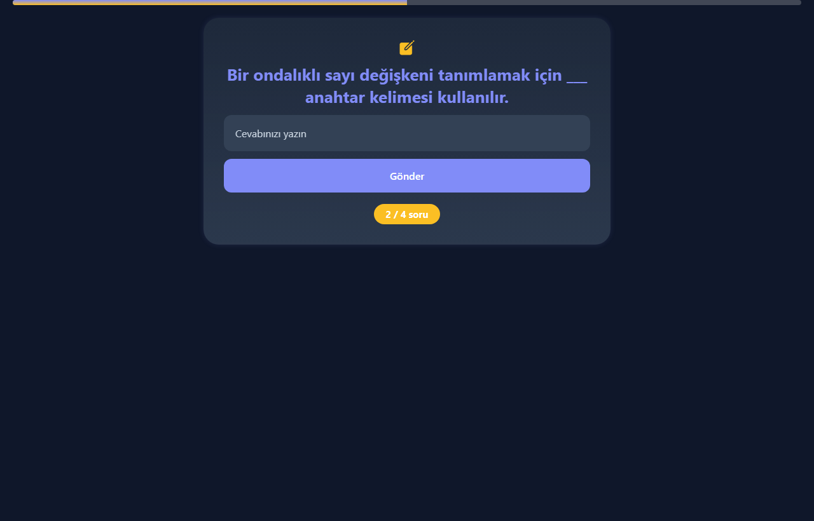 | 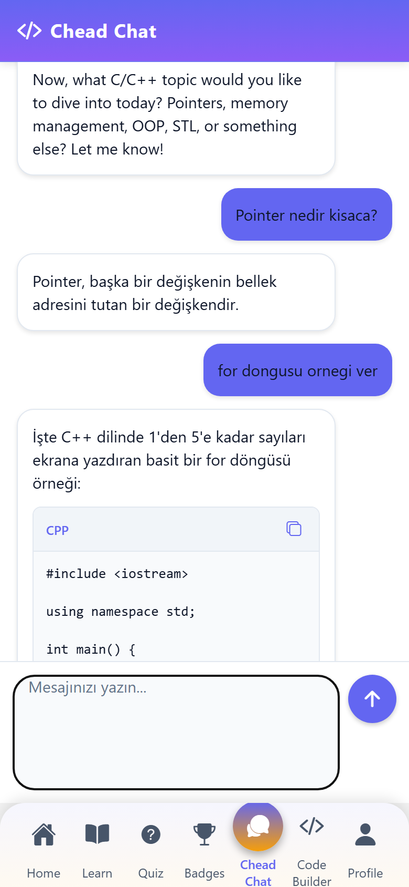 | 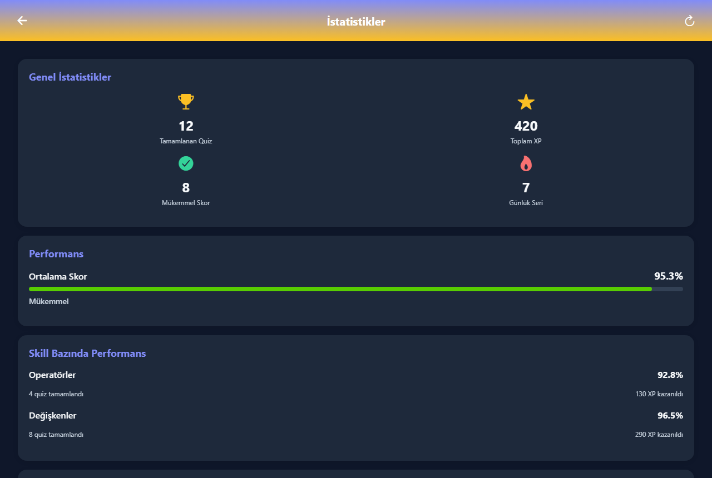 |

| AI Kod Oluşturucu | Yeni proje | Kod üretildi |
| :---: | :---: | :---: |
| 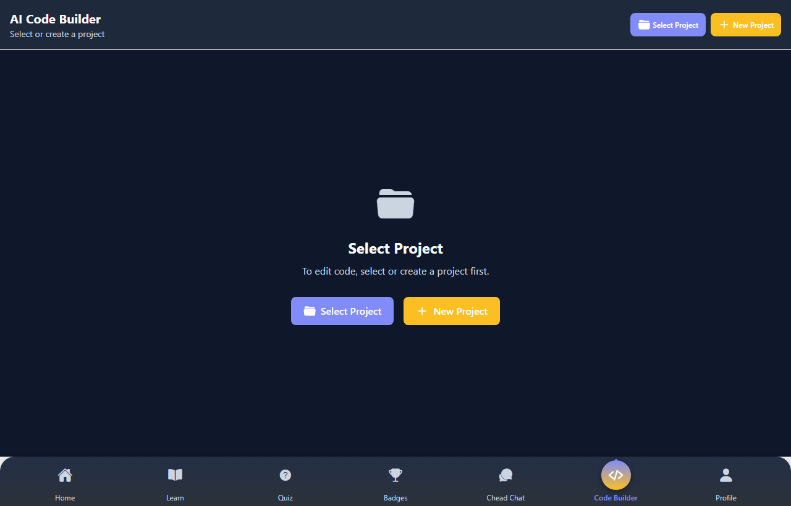 | 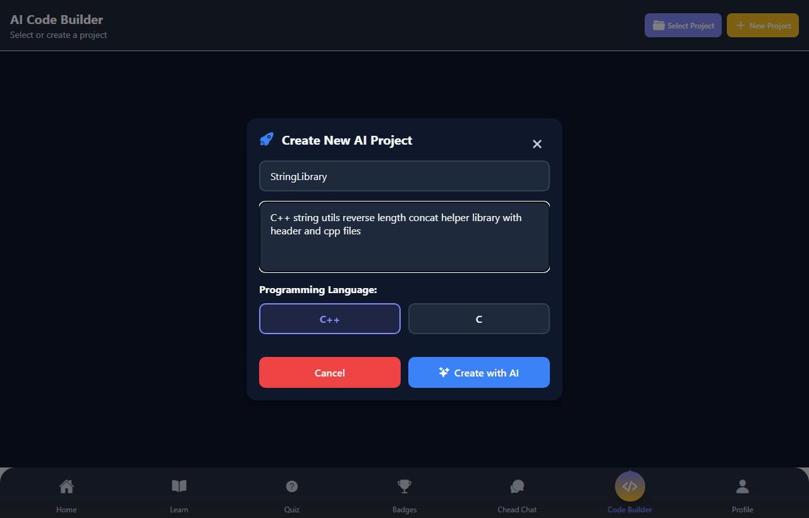 | 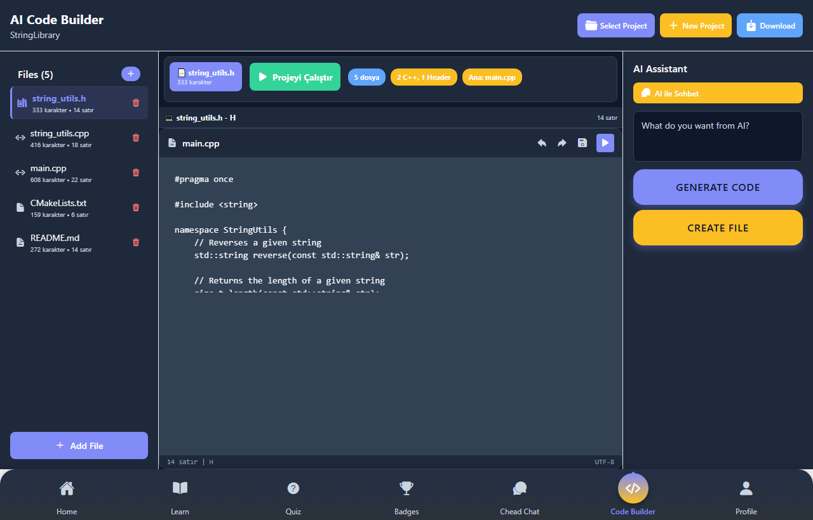 |

| Kod üretildi | Rastgele sorular | AI değerlendirme (başarılı) |
| :---: | :---: | :---: |
| 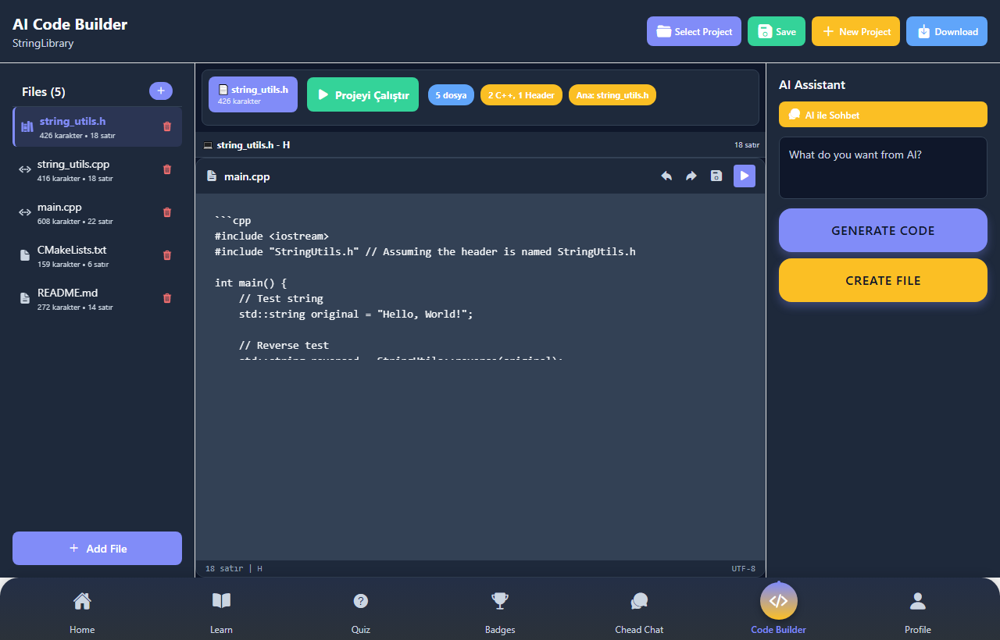 | 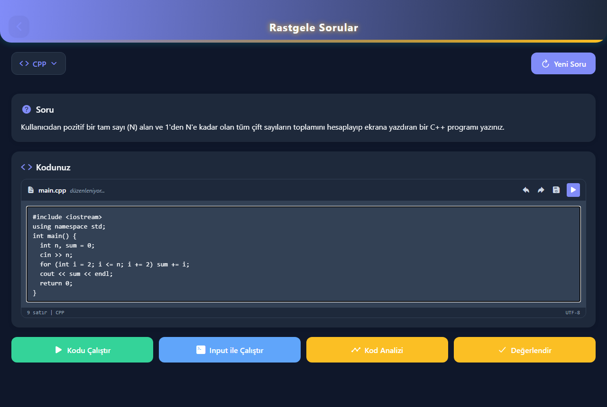 | 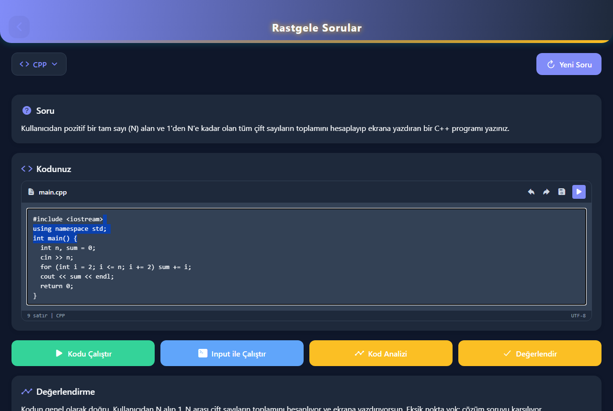 |

| Forum | Rozetler | Profil |
| :---: | :---: | :---: |
| 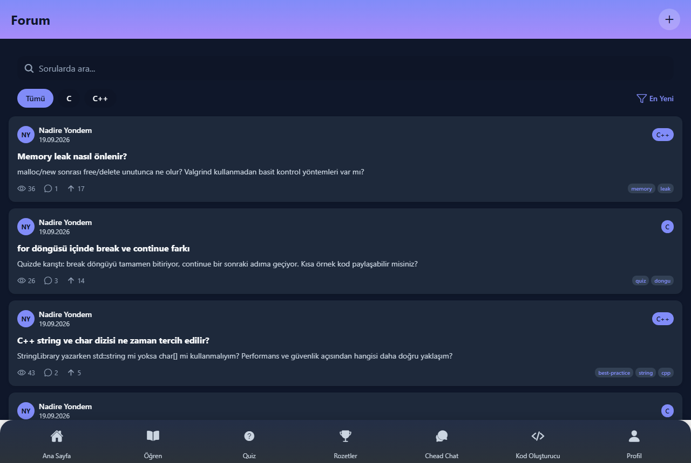 | 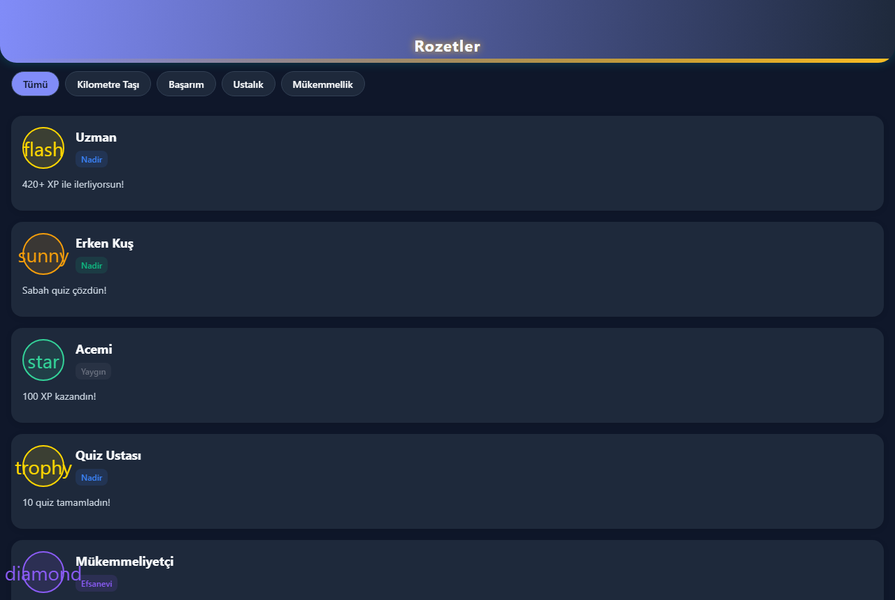 | 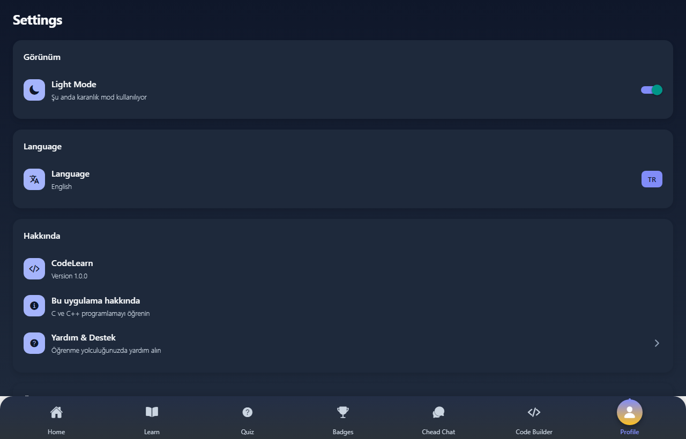 |

## Özellikler

- **Google ile giriş** — OAuth (`LoginScreen`)
- **Duolingo tarzı quiz** — seri sorular, tıkla / yaz-cevapla (`DuolingoQuizScreen`, `QuizSelectionScreen`)
- **Chead Chat** — Gemini çok turlu sohbet (`AiChatScreen`)
- **Topluluk forumu** — soru/cevap (`ForumListScreen`)
- **Kod + AI doğru/yanlış öneri** — Evaluate / kod analizi (`RandomQuestionScreen`, `CodeAnalysisScreen`)
- **İlerleme** — istatistik (`QuizStatsScreen`) ve rozetler (`BadgesScreen`)
- **AI Kod Oluşturucu** — Gemini ile proje üretimi
- **Judge0** — kod çalıştırma

## Yapı

```
CodeLearn/
├── frontend/     # Expo React Native (TypeScript)
├── nestjs/       # NestJS API (Gemini, auth, quiz, projects)
├── judge0/       # Kod çalıştırma servisi yapılandırması
└── docs/screenshots/
```

## Kurulum

### Gereksinimler

- Node.js 18+
- PostgreSQL, MongoDB
- (İsteğe bağlı) Judge0
- Google Gemini API anahtarı

### Backend

```bash
cd nestjs
cp .env.example .env
# .env içinde GEMINI_API_KEY ve veritabanı bilgilerini doldur
npm install
npm run start:dev
```

API varsayılan: `http://localhost:3000`

### Frontend

```bash
cd frontend
npm install
npx expo start
```

## Teknolojiler

Expo · React Native · TypeScript · NestJS · Gemini · MongoDB · PostgreSQL · Judge0

## Lisans

Eğitim amaçlı. Kaynak kod örnek olarak paylaşılmıştır.
